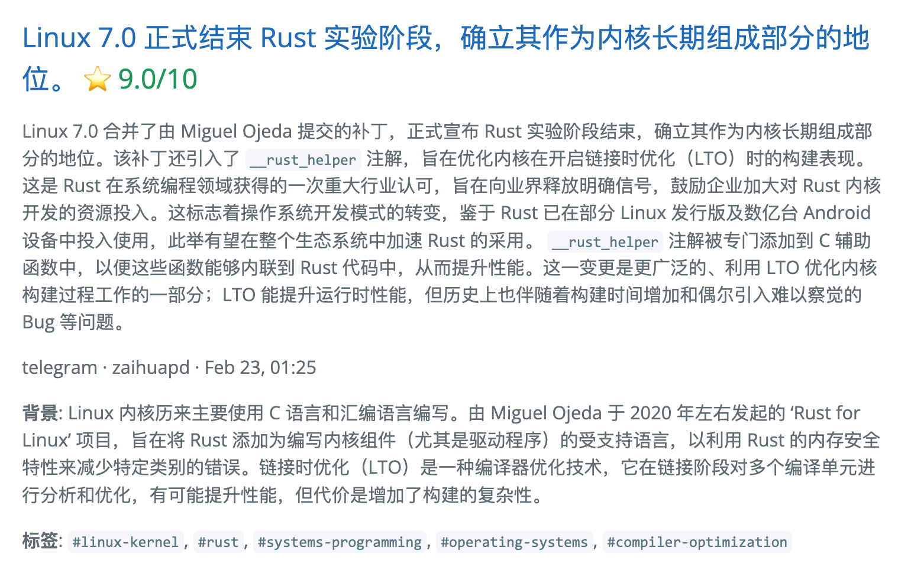

<div align="center">

# 🌅 Horizon

**AI curates the tech news. You just read.**

[](https://www.python.org/downloads/)
[](LICENSE)
[](https://github.com/astral-sh/uv)
[](https://thysrael.github.io/Horizon/)
[](https://github.com/Thysrael/Horizon/commits/main)
[](http://makeapullrequest.com)

<br>


<p align="center">
  
</p>

Horizon collects news from multiple customizable sources, uses AI to score and filter them, and generates a daily briefing — complete with summaries, community discussions, and background explanations in both English and Chinese.

[📖 Live Demo](https://thysrael.github.io/Horizon/) · [📋 Configuration Guide](docs/configuration.md) · [简体中文](README_zh.md)

</div>

## Screenshots

<table>
<tr>
<td width="50%">
<p align="center"><strong>Daily Overview (English)</strong></p>

</td>
<td width="50%">
<p align="center"><strong>Daily Overview (中文)</strong></p>

</td>
</tr>
<tr>
<td width="50%">
<p align="center"><strong>News Detail (English)</strong></p>

</td>
<td width="50%">
<p align="center"><strong>News Detail (中文)</strong></p>

</td>
</tr>
</table>

<details>
<summary><strong>Terminal Output</strong></summary>
<br>
<p align="center">
  
</p>
</details>

## Features

- **📡 Multi-Source Aggregation** — Collects from Hacker News, RSS feeds, Reddit, Telegram channels, and GitHub (releases & user events)
- **🤖 AI-Powered Scoring** — Uses Claude, GPT-4, Gemini, DeepSeek, Doubao, or any OpenAI-compatible API to rate each item 0-10, filtering out the noise
- **🌐 Bilingual Summaries** — Generates daily reports in both English and Chinese
- **🔍 Content Enrichment** — Searches the web to provide background knowledge for unfamiliar concepts
- **💬 Community Voices** — Collects and summarizes discussions from comments on HackerNews, Reddit, etc.
- **🔗 Cross-Source Deduplication** — Merges duplicate items from different platforms automatically
- **📰 Static Site Generation** — Deploys as a GitHub Pages site via GitHub Actions, updated on a schedule
- **⚙️ Fully Configurable** — Single JSON config file, easy to customize sources, thresholds, and AI providers

## How It Works

```
              ┌──────────┐
              │ Hacker   │
┌─────────┐   │ News     │   ┌──────────┐   ┌──────────┐   ┌──────────┐
│  RSS    │──▶│ Reddit   │──▶│ AI Score │──▶│ Enrich   │──▶│ Summary  │
│ Telegram│   │ GitHub   │   │ & Filter │   │ & Search │   │ & Deploy │
└─────────┘   └──────────┘   └──────────┘   └──────────┘   └──────────┘
  Fetch from      Merge &        Score          Web search     Generate
  all sources    deduplicate     0-10 each      background     Markdown &
                                & filter        knowledge      deploy site
```

1. **Fetch** — Pull latest content from all configured sources concurrently
2. **Deduplicate** — Merge items pointing to the same URL across different platforms
3. **Score** — AI rates each item 0-10 based on technical depth, novelty, and impact
4. **Filter** — Keep only items above your configured threshold (default: 6.0)
5. **Enrich** — For high-scoring items, search the web for background context and collect community discussions
6. **Summarize** — Generate a structured Markdown report with summaries, tags, and references
7. **Deploy** — Optionally publish to GitHub Pages as a daily-updated static site

## Quick Start

### 1. Install

```bash
git clone https://github.com/Thysrael/Horizon.git
cd horizon

# Install with uv (recommended)
uv sync

# Or with pip
pip install -e .
```

### 2. Configure

```bash
cp .env.example .env          # Add your API keys
cp data/config.example.json data/config.json  # Customize your sources
```

Here's what a config looks like:

```jsonc
{
  "ai": {
    "provider": "openai",       // or "anthropic", "gemini", "doubao"
    "model": "gpt-4",
    "api_key_env": "OPENAI_API_KEY",
    "languages": ["en", "zh"]   // bilingual output
  },
  "sources": {
    "hackernews": { "enabled": true, "fetch_top_stories": 20, "min_score": 100 },
    "rss": [
      { "name": "Simon Willison", "url": "https://simonwillison.net/atom/everything/" }
    ],
    "reddit": {
      "subreddits": [{ "subreddit": "MachineLearning", "sort": "hot" }],
      "fetch_comments": 5
    },
    "telegram": {
      "channels": [{ "channel": "zaihuapd", "fetch_limit": 20 }]
    }
  },
  "filtering": {
    "ai_score_threshold": 6.0,
    "time_window_hours": 24
  }
}
```

For the full reference, see the [Configuration Guide](docs/configuration.md).

### 3. Run

```bash
uv run horizon           # Run with default 24h window
uv run horizon --hours 48  # Fetch from last 48 hours
```

The generated report will be saved to `data/summaries/`.

### 4. Automate (Optional)

Horizon works great as a **GitHub Actions** cron job. See [`.github/workflows/daily-summary.yml`](.github/workflows/daily-summary.yml) for a ready-to-use workflow that generates and deploys your daily briefing to GitHub Pages automatically.

## Supported Sources

| Source | What it fetches | Comments |
|--------|----------------|----------|
| **Hacker News** | Top stories by score | Yes (top N comments) |
| **RSS / Atom** | Any RSS or Atom feed | — |
| **Reddit** | Subreddits + user posts | Yes (top N comments) |
| **Telegram** | Public channel messages | — |
| **GitHub** | User events & repo releases | — |

## Roadmap

- [x] Multi-source aggregation (HN, RSS, Reddit, Telegram, GitHub)
- [x] AI scoring with multiple providers
- [x] Bilingual summary generation (EN/ZH)
- [x] Web search for background enrichment
- [x] Community discussion collection
- [x] GitHub Pages deployment
- [ ] Email / Slack / Webhook notification
- [ ] Web UI dashboard
- [ ] More source types (Twitter/X, Discord, etc.)
- [ ] Custom scoring prompts per source

## Contributing

Contributions are welcome! Feel free to open issues or submit pull requests.

## License

[MIT](LICENSE)
